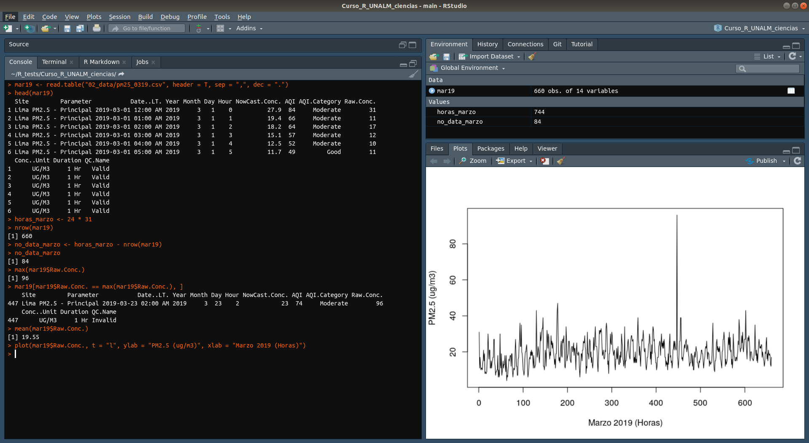
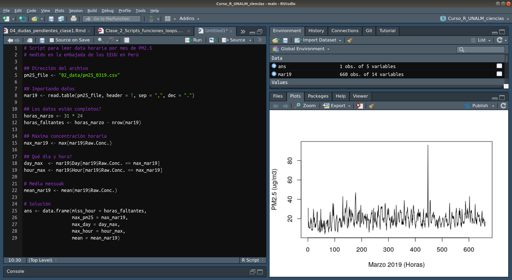
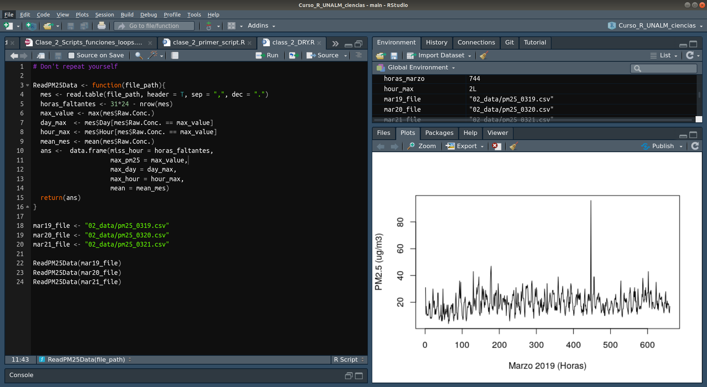
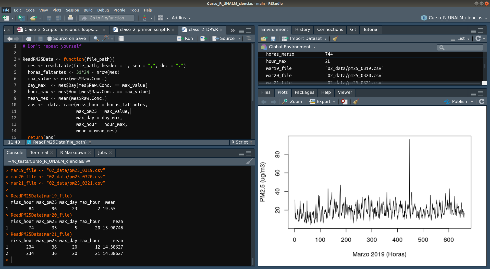
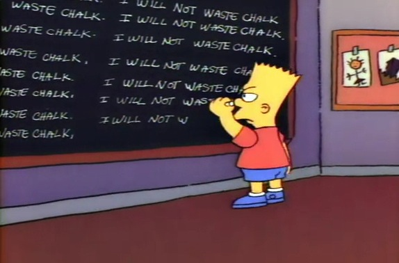

```{r setup, include=FALSE}
knitr::opts_chunk$set(echo = FALSE)
```

## El Menú de hoy

- Operaciones lógicas
- `subset()`
- Scripts
- Funciones
- Loops
- `packages`

# Operaciones lógicas

## Operaciones lógicas
- `TRUE` = 1
- `FALSE` = 0
- Conjunción es **y** , en R es **`&`**, equivale a **\***  
- Disjunción es **o** , en R es **`|`** , equivale a **+** 

## Operaciones lógicas
- Entonces:
  - **`TRUE & TRUE`**
  - **`TRUE & FALSE`**
  - **`FALSE & TRUE`**
  - **`FALSE & FALSE`**

## Operaciones lógicas
- Entonces:
```{r echo=T}
TRUE & TRUE
TRUE & FALSE
FALSE & TRUE
FALSE & FALSE
```

## Operaciones lógicas
- Entonces:
  - **`TRUE | TRUE`** 
  - **`TRUE | FALSE`**
  - **`FALSE | TRUE`**
  - **`FALSE | FALSE`**

## Operaciones lógicas
- Entonces:
```{r echo=T}
TRUE | TRUE
TRUE | FALSE
FALSE | TRUE
FALSE | FALSE
```

## Operaciones lógicas
- Mayor o menor que: `>`, `<`
- Mayor o menor igaul que: `>=`, `<=`
- Es igual que: `==`
- No es igual que: `!=`

# `subset()`

## **`subset()`**
- De `?subset`:
  - Retorna un subconjunto de vectores, matrices o data frames que **satisfacen las condiciones**
- **condiciones** = **operaciones lógicas**
- `subset(data, subset = _condiciones_)`

## **`subset()`**: Leyendo encuesta

```{r, echo=T}
survey <- read.table(
  "../02_data/respuestas27.csv",
  header = T,
  sep = ","
)
```

## **`subset()`**: Leyendo encuesta

```{r, echo=T}
names(survey) <- c("date", "name", "last.name",
                   "age", "district", "molinero",
                   "faculty", "year", "program",
                   "prog.lang", "os", "labs",
                   "Excel", "R", "why")
names(survey)
```

## **`subset()`**: Leyendo encuesta
- Cuántos estudian ing. ambiental
```{r, echo=T}
ing_amb <- subset(
  survey, 
  subset = faculty == "Ingeniería ambiental")
class(ing_amb)
nrow(ing_amb)
```

## **`subset()`**: Leyendo encuesta
- Cuántos son menores que la edad média
```{r, echo = T}
menores_edad_media <- subset(
  survey,
  subset = age < mean(survey$age)
)

nrow(menores_edad_media)
```

## **`subset()`**: Leyendo encuesta
- Qué estudia el más valiente
```{r, echo=T}
par_fin <- "No hago las prácticas me defiendo en el parcial y final"
temerario <- subset(
  survey,
  subset = labs == par_fin
)

temerario$faculty
```

## **`subset()`**: Leyendo encuesta
- Programan **y** saben Python
```{r, echo=T}
program_py <- subset(
  survey,
  subset = (program == "Sí" | program == "Algo" & 
              prog.lang == "Python")
)

head(program_py[, c("program", "prog.lang")], 5)
```

# Scripts

## Qué es un script?

- Una **receta**: _Script para analisar resultados de encuesta_.
  - Serie de operaciones (`statements`) en un archivo de texto (`*.R`)
- Consola de R para **experimentar**: _Qué hace está función?_
- Editor de texto[^*]:
  - **Espacio** para trabajar
  - Código que **funciona** y nos **importa**

[^*]: Wickham & Grolemund, 2016

## 
```{r, out.width="110%", fig.align="center"}

```

## 
```{r, out.width="110%", fig.align="center"}

```

## Scripts

- Un proceso ordenado
- Suceptible a mejoras
- Más fácil de compartir

# Funciones

## Funciones

```{r, echo=TRUE, eval=F}
functionName <- function(arg1, arg2, ...){
  statements1
  statements2
  ...
  return(object)
}
```


## Funciones: Ejemplos prácticos
- Cubo de un número
```{r, echo=T}
CuboNumero <- function(x){
  cubo <- x * x * x
  return(cubo)
}

CuboNumero(3)
```

## Funciones: Ejemplos prácticos
- Más argumentos
```{r, echo=T}
MyAge <- function(this_year, born_year){
  my_age <- this_year - born_year
  return(my_age)
}

MyAge(2020, 1988)
```

## Funciones: Ejemplos prácticos
```{r, echo=T}
MediaVector <- function(vec){
  suma <- sum(vec)
  n <- length(vec)
  media <- suma / n
  return(media)
}

mi_vector <- c(1, 4, 5, 6, 15)
MediaVector(mi_vector)
```

## Scripts y funciones

Usualmente un **script** puede transformarse en una **función**.

## 
```{r, out.width="110%", fig.align="center"}

```


## 
```{r, out.width="110%", fig.align="center"}

```

## 
```{r, out.width="110%", fig.align="center"}

```

# Loops

## Loops
```{r, out.width="70%", fig.align="center"}

```

From: Bart the Genius

Season 1, Episode 2

In: <http://bartsblackboard.com/tag/chalk/>


## Loops

- Sintaxis
```{r, echo=T, eval=F}
for (var in sequence){
  statements
}
```


## Loops
- Haciendo la tarea de Bart
```{r, echo=T}
for (i in seq(1, 10)){
  print("Ya no gastaré más tiza")
}
```

## Loops: Ejemplos prácticos
- Por **posición**
```{r, echo=T}
tempC <- c(20, 22, 23, 25)
for (i in seq(1, length(tempC))){
  print(tempC[i] + 273.15)
}
```

## Loops: Ejemplos prácticos
- Por **elemento**
```{r, echo=T}
tempC <- c(20, 22, 23, 25)
for (t in tempC){
  print(t + 273.15)
}
```

## Loops: Ejemplos prácticos
- Una función a un vector
```{r, echo=T}
for (i in mi_vector){
  print(CuboNumero(i))
}
```

## Loops: Advertencia
- Obviamente es más sencillo:
```{r, echo=T}
tempC + 273.15
CuboNumero(mi_vector)
```
- Loops son importantes para *automatizar*

## Don't repeat yourself (DRY)
- Es un principio de programación
- Si estás reescribiendo código es momento de:
   - Crear una **función**
   - Hacer un **loop**

# Packages

## Packages
- Conjunto de funciones desarrolladas para tareas _**ad hoc**_:
   - Análisis de datas contaminación de aire: **`openair`**
   - Crear aplicaciones: **`shiny`**
   - GIS: **`sf`** y **`raster`**
   - Webscrapping: **`RCurl`**
   - *Etcetera*
   
## Packages
- Instalación
```{r, echo=T, eval=F}
install.packages("openair") # Simpre colocar las " "
```
- Utilizar
```{r, echo=T, eval=F}
library(openair) # No es neceario las " "
```

- Buena práctica: Colocarlas al inicio de cada script

# Otro si digo

## Otros objetos
- Existen otros tipos de objetos:
   - listas: `list()`
   - matrizes: `matrix()`
   - factores: `as.factor()`
   - **fechas: `as.POSIXct()`**
   
## as.POSIXct
- Le dice a R que estos son datos de fechas
- Importante en análisis de series temporales
```{r, echo=T}
mar19 <- read.table(
  "../02_data/pm25_0319.csv",
  header = T,
  sep = ",",
  dec = "."
)

head(mar19)
```

## as.POSIXct
```{r, echo=T}
mar19$date <- as.POSIXct(
  strptime(
    mar19$Date..LT., format = "%Y-%m-%d %I:%M %p"
  ),
  tz = "America/Lima"
)

head(mar19)
```

## as.POSIXct
```{r, echo=T, eval=F}
plot(mar19$Raw.Conc., t = "l", 
     main = "PM25 concentration at USA embassy", 
     ylab = "PM25 (ug/m3",
     xlab = "March 2019")

```


## as.POSIXct
```{r}
plot(mar19$Raw.Conc., t = "l", 
     main = "PM25 concentration at USA embassy", 
     ylab = "PM25 (ug/m3",
     xlab = "March 2019")

```

## as.POSIXct
```{r, echo=T, eval=F}
plot(mar19$date, mar19$Raw.Conc., t = "l", col = "red",
     main = "PM25 concentration at USA embassy", 
     ylab = "PM25 (ug/m3",
     xlab = "March 2019")

```

## as.POSIXct
```{r}
plot(mar19$date, mar19$Raw.Conc., t = "l", col = "red", 
     main = "PM25 concentration at USA embassy", 
     ylab = "PM25 (ug/m3",
     xlab = "March 2019")

```


